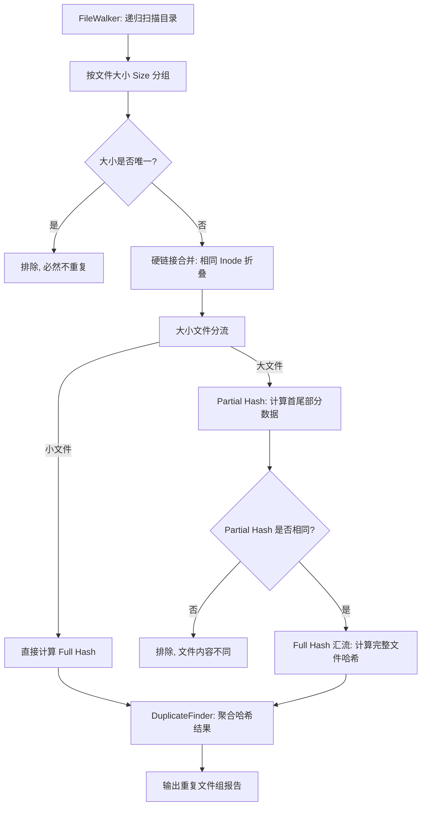

# Dedup (FileSystemTools)

一个基于 `ThreadPool` 的高性能、多线程并行文件去重命令行工具，旨在高效递归扫描目录并找出重复文件组。针对现代固态硬盘（SSD/NVMe）的并发特性以及机械硬盘（HDD）的寻道惩罚，进行了针对性的 I/O 与并发调度优化。

[🚀 快速开始](#快速开始-) · [✨ 核心特性](#核心特性-) · [🧩 架构设计](#架构设计-) · [🛠️ 构建与测试](#构建与测试-) · [📊 性能基准](#性能基准-)

---

## 快速开始 🚀

### 1. 编译安装
```bash
cmake -S . -B build -DCMAKE_BUILD_TYPE=Release
cmake --build build -j
```

### 2. 基本使用
```bash
# 默认单线程运行（保护 HDD 硬盘，避免磁头抖动）
./build/src/dedup /path/to/directory

# SSD 开启 8 线程并发扫描（极速榨干 I/O 与 CPU 性能）
./build/src/dedup /path/to/directory --threads 8
```

> [!IMPORTANT]
> **I/O 性能最佳实践**：
> * **机械硬盘（HDD）**：请**不要**开启多线程（默认 `--threads 1`）。并发随机寻道会导致严重的“磁头抖动 (Disk Thrashing)”，使性能发生断崖式下跌。
> * **固态硬盘（SSD/NVMe）**：建议根据 CPU 核心数开启多线程（例如 `--threads 8`），这能带来数倍甚至数十倍的读取与 Hash 计算吞吐速度！

---

## 核心特性 ✨

* **🚀 深度并发与 I/O 调度**：底层采用高性能通用线程池 `ThreadPool` 进行哈希分块并行计算，多线程读取与计算高度流水线化。
* **🛡️ 零拷贝与硬链接折叠**：智能检测并合并相同物理 inode 的硬链接文件，避免不必要的重复哈希 I/O，并且通过引用传递消除多余数据拷贝。
* **⚡ 大小文件分流漏斗**：
  * **小文件**：采用极低的固定成本直接进行哈希。
  * **大文件**：采用 **Partial Hash 漏斗机制**（首部 + 尾部快速哈希筛选），过滤不匹配项，仅在必要时计算 Full Hash，避免海量大文件全盘读取。
* **🎯 密码学级哈希算法**：引入 BLAKE3 高性能哈希算法（通过汇编/SIMD指令集加速），既保证极高的哈希计算吞吐，又杜绝了哈希碰撞风险。
* **🛠️ 优雅集成与 C++11 标准**：严格基于 C++11 标准，通过 CMake `FetchContent` 零依赖集成，轻量高效。

---

## 架构设计 🧩

`dedup` 的去重流程由一个精心设计的多层过滤漏斗组成，在尽可能减少磁盘 I/O 的前提下找出重复文件：



---

## 构建与测试 🛠️

```bash
# 开启测试构建
cmake -S . -B build -DBUILD_TESTING=ON
cmake --build build -j

# 运行单元测试与 CLI 集成测试
ctest --test-dir build --output-on-failure
```

---

## 性能基准 📊

本工具内置了针对业界去重利器 `jdupes` 的系统级 Benchmark 脚本。

### 1. 运行基准测试
```bash
# 编译 benchmark 目标（推荐 Release 模式）
cmake -S . -B build-bench -DBUILD_BENCHMARKS=ON -DCMAKE_BUILD_TYPE=Release
cmake --build build-bench -j

# 运行微观 Benchmark
./build-bench/benchmark/dedupBenchmark --benchmark_min_time=1.0 --benchmark_repetitions=3
```

### 2. 导出测试报告与对比
你也可以运行系统自带的测试脚本，生成 2.5 GB 混合数据集自动测试：
```bash
mkdir -p benchmark/results
./build-bench/benchmark/dedupBenchmark --benchmark_format=json --benchmark_out=benchmark/results/latest.json
```
关于去重漏斗架构优化以及并发调优的详细分析，请参考 [docs/总览.md](docs/总览.md)。